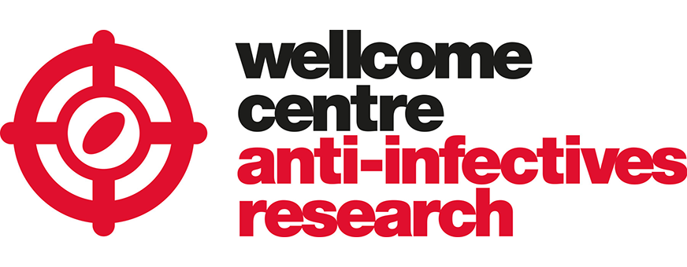

# Oligo-targeting for editing and profiling drug-resistant drug-targets in parasitic trypanosomatids
## This repository contains the scripts used for the data analysis
    
    Wellcome Centre for Anti-Infectives Research
    School of Life Sciences, University of Dundee

The Jupyter notebook
- Figures_Paper_def.ipynb

produces the codon counts and figures

Several new drugs, with known targets, are in clinical development against sleeping sickness, Chagas disease or leishmaniasis, but our understanding of resistance-associated mutations remains incomplete. We report the development of oligo-targeting for templated precision editing of these priority drug-targets. The outputs provide confirmation of on-target activity, reveal multiple distinct mutations at the same site that can yield drug-resistance, and facilitate rapid assessment of potential impacts on anti-parasite drug efficacy.
